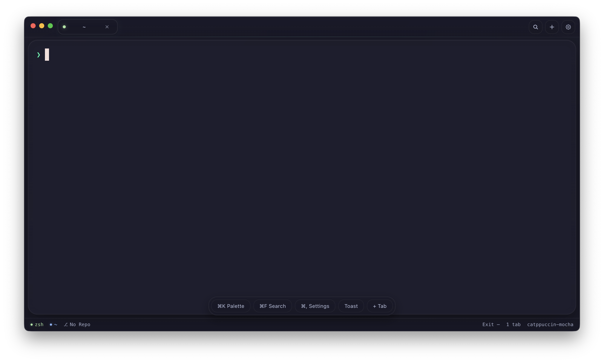

# BasedShell

BasedShell is a keyboard-first macOS terminal app built with Electron, `node-pty`, and `xterm.js`.

## UI Showcase

Main terminal window:



## Highlights

- Native PTY sessions (login shell) with sanitized runtime environment
- Multi-tab workflow with activity states (active, unread, exited)
- Split panes inside each tab (vertical/horizontal, depth cap, keyboard resize/focus)
- Status HUD with shell/cwd/git/exit context
- Command palette with fuzzy actions, pins, and recents
- Inline terminal search with case/regex toggles and next/prev navigation
- Theme system for terminal + chrome:
  - `graphite`, `midnight`, `solarized-dark`, `paper`, `aurora`, `noir`, `fog`
  - `catppuccin-latte`, `catppuccin-frappe`, `catppuccin-macchiato`, `catppuccin-mocha`
  - `system` theme selection + system appearance sync
- Settings support for font, cursor, scrollback, opacity, vibrancy, and prompt style (`system` / `minimal`)
- Prompt style option for clean `❯` prompt (no user@host), applied per new session
- Packaged macOS builds via `electron-builder`

## Run

Install dependencies:

```bash
npm install
```

Development:

```bash
npm run dev
```

Typecheck + DOM contract check:

```bash
npm run typecheck
```

Production run:

```bash
npm run start
```

Build distributables:

```bash
npm run package:mac
```

## Releases and Updates

- Maintainer release process: `RELEASING.md`
- CI release workflow: `.github/workflows/release-macos.yml`
- Release readiness plan: `docs/release-readiness-plan.md`
- Latest downloads: https://github.com/XtraSaltyDev/BasedShell/releases/latest

### Unsigned Community Builds (macOS)

If a build is unsigned, macOS may block the first launch.

1. Open `/Applications` in Finder.
2. Right-click `BasedShell.app` and choose `Open`.
3. Confirm `Open` in the Gatekeeper prompt.

Manual update flow for unsigned builds:

1. Download the latest release from the Releases page.
2. Quit BasedShell.
3. Replace `BasedShell.app` in `/Applications`.
4. Reopen BasedShell.

## Key Shortcuts

- `Cmd/Ctrl+T`: New tab
- `Cmd/Ctrl+W`: Close active tab
- `Cmd/Ctrl+F`: Find in terminal
- `Cmd/Ctrl+Shift+P`: Command palette
- `Cmd/Ctrl+,`: Open settings
- `Cmd/Ctrl+K`: Clear terminal
- `Cmd/Ctrl+Alt+D`: Split vertical
- `Cmd/Ctrl+Alt+Shift+D`: Split horizontal
- `Cmd/Ctrl+Alt+Arrow`: Focus split pane
- `Cmd/Ctrl+Alt+Shift+Arrow`: Resize split pane

## Architecture

- `src/main`: Electron main process (windows, IPC handlers, PTY session manager, settings persistence)
- `src/preload`: Typed secure bridge exposed to renderer
- `src/renderer`: Terminal UI, tabs/panes, command palette, search, toasts, settings drawer
- `src/shared`: Cross-process contracts, pane model, theme metadata/types

## Notes

- `node-pty` requires native build tooling.
- `postinstall` runs `scripts/fix-node-pty-helper.mjs` to ensure `spawn-helper` is executable on macOS.
- Runtime settings/window state are stored under `~/Library/Application Support/BasedShell` (macOS default).
- `output/` is intentionally gitignored for local artifacts.
